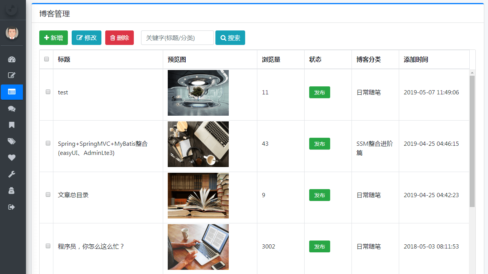
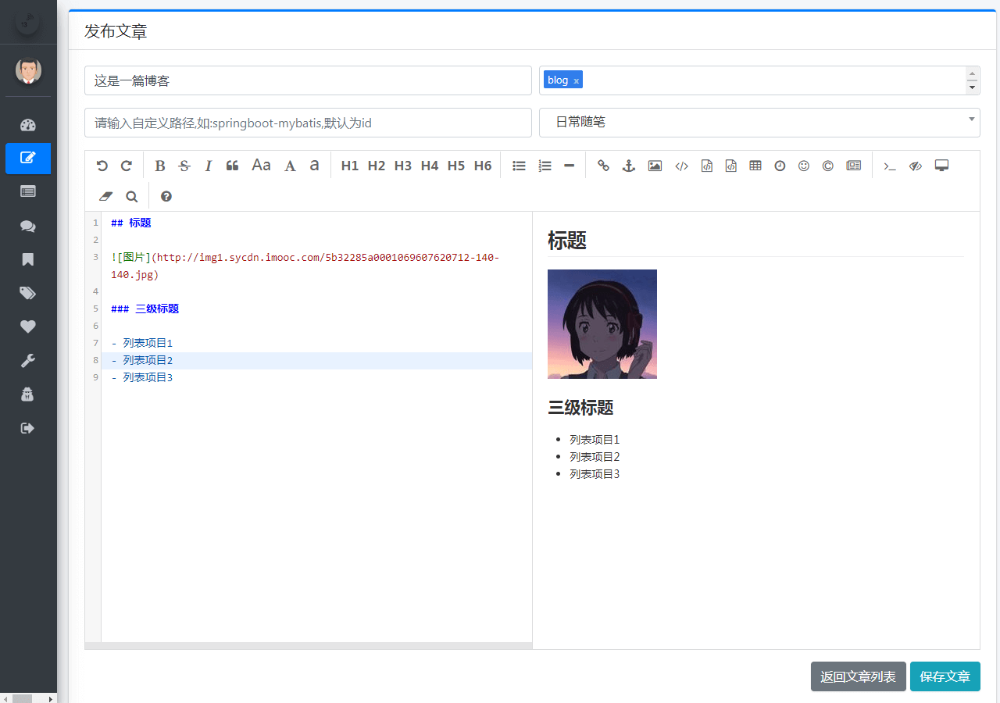

# Loner_Blog

该项目基于[My Blog](https://github.com/ZHENFENG13/My-Blog) 二次开发。目前知识复制了一些代码，待完善中。


## 计划

通过Ant Design Pro重写前端


## 进度

### 2022-02-18 

0%

### 2022-02-19

* 更新验证码随机串生成方式从Random改为SecureRandom。改进建议来自：Abby。

* 引入ant design pro，并简单的修剪

参考图：


------


**坚持不易，各位朋友如果觉得项目还不错的话可以给项目一个 star 吧，也是对我一直更新代码的一种鼓励啦，谢谢各位的支持。**

- **你可以拿它作为博客模板，因为 My Blog 界面十分美观简洁，满足私人博客的一切要求；**
- **你也可以把它作为 SpringBoot 技术栈的学习项目，My Blog也足够符合要求，且代码和功能完备；**
- **内置三套博客主题模板，主题风格各有千秋，满足大家的选择空间，后续会继续增加，以供大家打造自己的博客；**
- **技术栈新颖且知识点丰富，学习后可以提升大家对于知识的理解和掌握，对于提升你的市场竞争力有一定的帮助。**

> 更多 Spring Boot 实战项目可以关注十三的另一个代码仓库 [spring-boot-projects](https://github.com/ZHENFENG13/spring-boot-projects)，该仓库中主要是 Spring Boot 的入门学习教程以及一些常用的 Spring Boot 实战项目教程，包括 Spring Boot 使用的各种示例代码，同时也包括一些实战项目的项目源码和效果展示，实战项目包括基本的 web 开发以及目前大家普遍使用的前后端分离实践项目等，后续会根据大家的反馈继续增加一些实战项目源码，摆脱各种 hello world 入门案例的束缚，真正的掌握 Spring Boot 开发。

关注公众号：**程序员十三**，回复"勾搭"进群交流。


## 注意事项

- **数据库文件目录为```static-files/my_blog_db.sql```；**
- **部署后你可以根据自己需求修改版权文案、logo 图片、备案记录等网站基础信息；**
- **My Blog 后台管理系统的默认登陆账号为 admin 默认登陆密码为 123456；**
- **layui 版本的 My-Blog，仓库地址 [My-Blog-layui](https://github.com/ZHENFENG13/My-Blog-layui) ，感兴趣的朋友也可以学习一下；**
- **My Blog 还有一些不完善的地方，鄙人才疏学浅，望见谅；**
- **有任何问题都可以反馈给我，我会尽量完善该项目。**

[](https://travis-ci.org/ZHENFENG13/My-Blog)

[](https://github.com/ZHENFENG13/My-Blog/blob/master/LICENSE)

## 效果预览

### 后台管理页面

- 登录页

	

- 后台首页

	

- 文章管理

	

- 文章编辑

	

- 评论管理

	

- 系统配置

	

